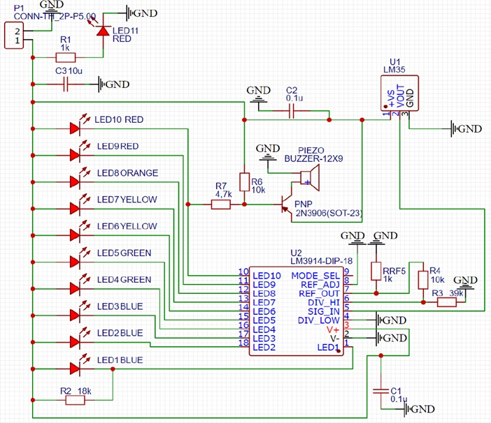
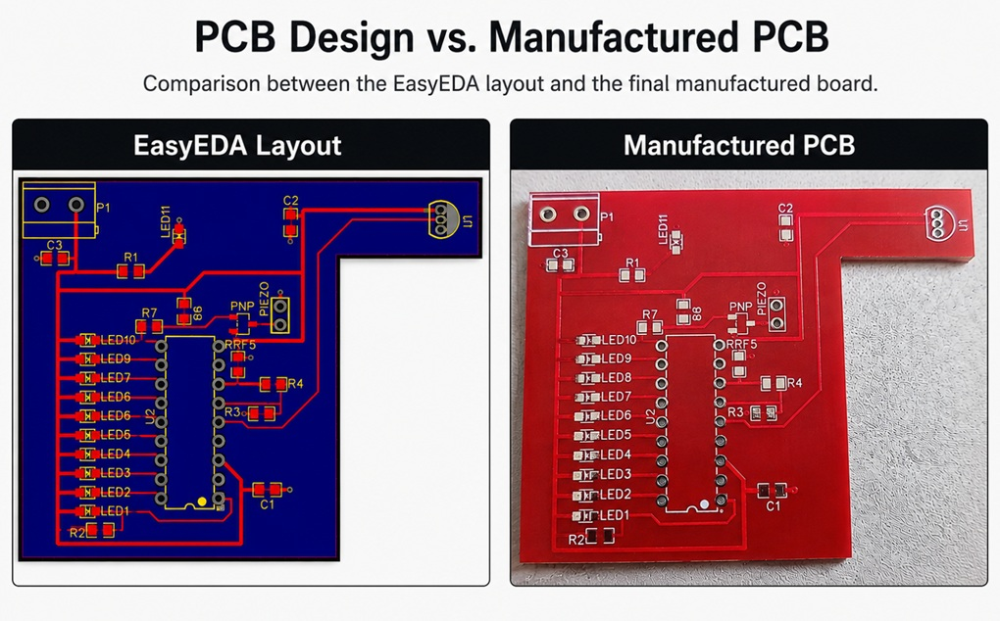
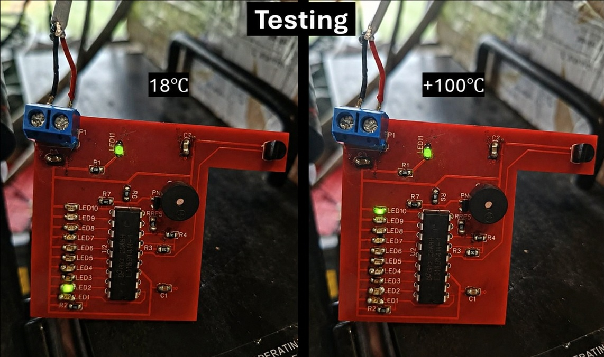

# temperature-indicator-pcb
This project presents a custom PCB design of an analog temperature indicator based on the LM35 temperature sensor and the LM3914 LED driver.

## Features

- Custom PCB design
- Analog temperature measurement
- LM35 temperature sensor
- LM3914 LED driver
- LED bar graph display
- Buzzer alarm at 100°C

## Schematic

## Manufactured PCB

## Assembled PCB

## Documentation

Project documentation: **Project_Documentation_PL.pdf**
